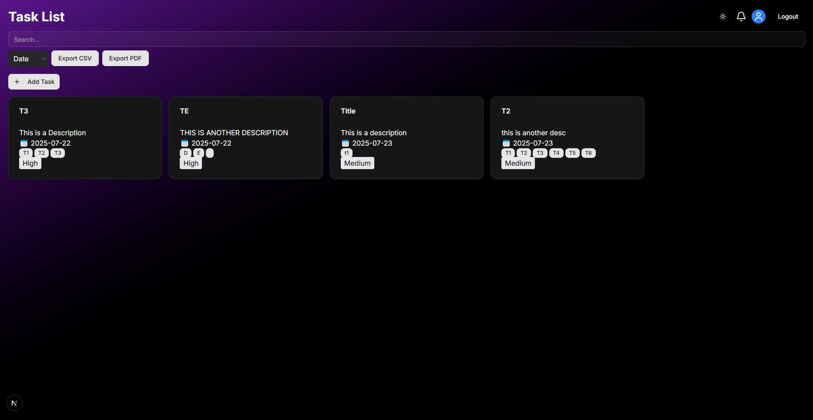
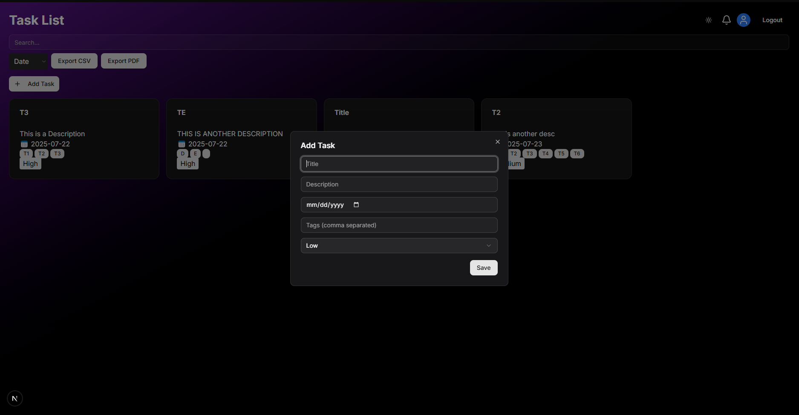

# Flutter To-Do List App with Supabase

A mobile To-Do app built with Flutter and Supabase backend featuring:

- User authentication (Sign up / Sign in)
- Add, edit, delete tasks
- Drag & drop task reordering
- Dark mode toggle
- Search and sort tasks
- Export tasks to PDF and CSV
- Real-time sync with Supabase

---

## Screenshot

  
*Dashboard Design I*

  
*Dashboard Design II*
---

## Prerequisites

- Flutter SDK (version 3.0.0 or higher)  
  Install from: [https://flutter.dev/docs/get-started/install](https://flutter.dev/docs/get-started/install)
- Android Studio or Xcode (for running on Android/iOS devices or emulators)
- Supabase account and project with configured `tasks` table

---

## Installation & Setup

1. **Clone the repository**

   ```bash
   git clone https://github.com/ZakiOmer22/next_todo_app.git
   cd next_todo_app
   
2. **Install dependencies**

   ```bash
   flutter pub get
   ```

3. **Configure Supabase**

   * Create a new project on [Supabase](https://supabase.com/)
   * Set up a `tasks` table with the following columns:

     * `id` (primary key)
     * `title` (text)
     * `description` (text, nullable)
     * `date` (timestamp, nullable)
     * `tags` (text array, nullable)
     * `priority` (text)
     * `order` (integer)
     * `user_id` (UUID, foreign key)
   * Copy your Supabase project URL and anon key
   * Open `lib/main.dart` and replace the placeholder constants:

   ```dart
   const supabaseUrl = 'YOUR_SUPABASE_URL';
   const supabaseAnonKey = 'YOUR_SUPABASE_ANON_KEY';
   ```

4. **Run the app**

   Connect your device or launch an emulator, then run:

   ```bash
   flutter run
   ```

---

## Features

* **Authentication:** Sign up, log in, and persist sessions with Supabase.
* **Task Management:** Add, edit, and reorder tasks via drag-and-drop.

## Troubleshooting

* **Icons not showing:**
  Ensure your `pubspec.yaml` includes:

  ```yaml
  flutter:
    uses-material-design: true
  ```

* **Android NDK version conflicts:**
  If you see NDK version errors during build, edit your `android/app/build.gradle.kts` file to specify the highest NDK version:

  ```kotlin
  android {
      ndkVersion = "27.0.12077973"
      ...
  }
  ```

---

## License

This project is licensed under the MIT License - see the [LICENSE](LICENSE) file for details.

---

## Contact

For questions or feedback, contact: \[[zakiomer@zamufey.com](mailto:your.zakiomer@zamufey.com)]
